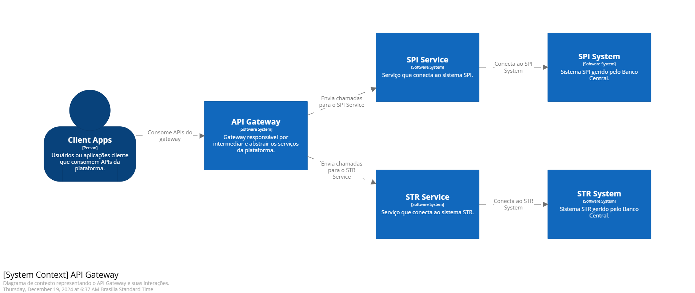
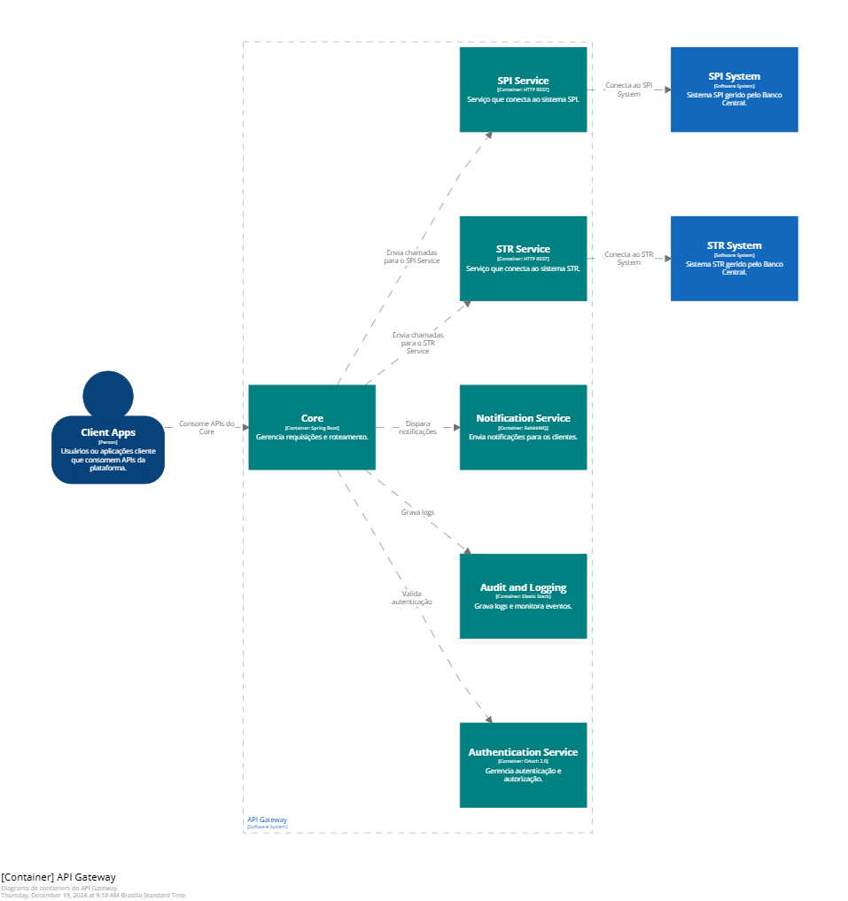
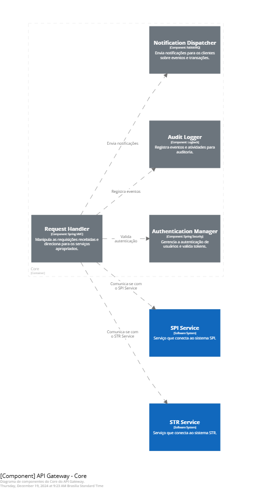

# C4 Model - API Gateway para Integração com RSFN

Este documento apresenta as três camadas do **C4 Model** utilizadas para descrever a arquitetura de um **API Gateway** para integração com o RSFN (Sistema Financeiro Brasileiro), incluindo os sistemas SPI e STR. O modelo abrange **contexto**, **container** e **componentes**, proporcionando uma visão clara de cada nível da arquitetura.

---

## [System Context] API Gateway

### Propósito:
- Representar a interação do **API Gateway** com os sistemas externos (SPI, STR) e os aplicativos clientes (Client Apps).

### Objetivo:
- Demonstrar a visão geral do sistema, destacando os principais atores e suas responsabilidades:
  - **Client Apps**: Usuários ou aplicativos que consomem APIs.
  - **SPI Service e STR Service**: Serviços internos que conectam ao SPI e STR.
  - **SPI System e STR System**: Sistemas externos geridos pelo Banco Central.

### Entrega:
- Visão de alto nível para alinhar equipes de negócios e técnicas, explicando como o sistema se posiciona no ecossistema.

### Vantagens:
- Facilita a comunicação entre equipes ao fornecer um resumo simples do sistema.
- Ajuda no entendimento das integrações e interdependências com sistemas externos.

---

## [Container] API Gateway

### Propósito:
- Fornecer uma visão detalhada dos contêineres e serviços do sistema, mostrando como eles interagem.

### Objetivo:
- Descrever como o **Core** do API Gateway gerencia requisições, interage com os serviços SPI/STR e outros serviços auxiliares:
  - **Core**: Roteia e gerencia requisições.
  - **SPI Service e STR Service**: Responsáveis pela comunicação com SPI e STR.
  - **Notification Service**: Envia notificações aos usuários.
  - **Audit and Logging**: Realiza auditoria e grava logs de eventos.
  - **Authentication Service**: Gerencia autenticação e autorização.

### Entrega:
- Mapa dos serviços que compõem o sistema, com suas responsabilidades claramente definidas.

### Vantagens:
- Permite identificar dependências e pontos críticos para escalabilidade e segurança.
- Auxilia no planejamento de deploys e monitoração.

---

## [Component] API Gateway - Core

### Propósito:
- Detalhar os componentes internos do **Core** do API Gateway.

### Objetivo:
- Explicar o funcionamento interno do **Core**, incluindo:
  - **Request Handler**: Manipula requisições e direciona para os serviços apropriados.
  - **Authentication Manager**: Valida autenticação dos usuários.
  - **Audit Logger**: Registra eventos e atividades.
  - **Notification Dispatcher**: Envia notificações para os clientes.

### Entrega:
- Diagrama detalhado do fluxo de requisições dentro do Core, com os principais componentes.

### Vantagens:
- Facilita o desenvolvimento, debugging e manutenção do Core.
- Proporciona clareza sobre as responsabilidades de cada componente.

---

## Conclusão

Este C4 Model fornece uma visão hierárquica da arquitetura do **API Gateway**, ajudando a alinhar equipes técnicas e de negócios. Ele oferece:
1. **Clareza nas responsabilidades** de cada parte do sistema.
2. **Facilidade na comunicação** entre equipes técnicas e não-técnicas.
3. **Suporte para planejamento** de desenvolvimento, deploys e melhorias.

### Links Relacionados:
- [Documentação sobre RSFN e Integrações](./Sistema_Financeiro_Brasileiro.md)
- [Proposta de Arquitetura](./Software_Architecture_Challenge.md)
