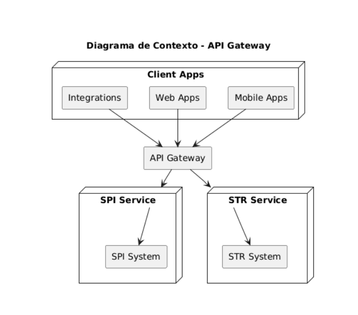
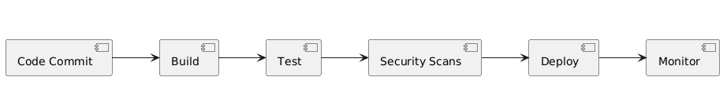

# Software Architecture Challenge Document

## Introduction
This document outlines the proposed solutions for the architecture of a platform that integrates with the Brazilian financial system network (RSFN), specifically targeting the SPI and STR systems. It also addresses the topics of Tech Stack, Software Architecture, DevOps, and Project Management.

---

## Tech Stack

### Programming Languages:
- **Java**: For backend development due to its strong support for financial systems and high scalability.
- **Python**: For scripting, data integration, and automation tasks.
- **JavaScript/TypeScript**: For API gateway and client-side interfaces.

### API Technologies and Standards:
- **REST**: For external APIs to provide simplicity and compatibility.
- **gRPC**: For internal microservice communication to ensure high performance and type safety.
- **OAuth2/OpenID Connect**: For secure authentication and authorization.

### Frameworks or Major Libraries:
- **Spring Boot**: For backend microservices to ensure rapid development and integration with Java.
- **FastAPI**: For Python-based services that require quick development cycles.
- **Node.js**: For handling real-time notification services.
- **Swagger/OpenAPI**: For API documentation and testing.

### Supporting Services:
- **PostgreSQL**: For relational data storage with ACID compliance.
- **Redis**: For caching and session management.
- **Kafka**: For event streaming and message brokering.
- **Prometheus & Grafana**: For monitoring and observability.
- **AWS S3 or GCP Storage**: For secure file storage and backups.
- **Elastic Stack (ELK)**: For centralized logging.

---

## Software Architecture

### Services to Develop:

#### 1. **SPI Integration Service:**
Responsible for communicating with the SPI system. This service will manage real-time payment processing, ensuring compliance with the SPI protocols. It will include a queue for handling high transaction volumes and retries for failed transactions.

#### 2. **STR Integration Service:**
Handles communication with the STR system for large-value settlements. This service will focus on secure and reliable message exchange, implementing encryption and validation protocols required by the RSFN.

#### 3. **API Gateway:**
Acts as the entry point for client applications, standardizing and abstracting access to SPI and STR services. It will include rate limiting, authentication, and logging.

#### 4. **Authentication and Authorization Service:**
Provides OAuth2-based authentication and role-based access control (RBAC) for the platform.

#### 5. **Audit and Logging Service:**
Tracks all transactions and system events to ensure compliance and enable traceability.

#### 6. **Notification Service:**
Sends notifications (e.g., via email or SMS) about transaction statuses or errors to the relevant stakeholders.

### High-Level Architecture Diagram:

## DevOps

### DevOps Pipeline:
1. **Code Commit:** Developers push code to the version control system.
2. **Build:** Continuous integration triggers a build process.
3. **Test:** Automated unit, integration, and acceptance tests are run.
4. **Security Scans:** Static and dynamic code analysis.
5. **Deployment:** Continuous deployment to staging and production environments.
6. **Monitoring:** Post-deployment monitoring and alerting.

### DevOps Pipeline Diagram:

### Recommendations:
- **Version Control System:** GitHub or GitLab.
- **Branching Strategy:** GitFlow to manage feature, release, and hotfix branches.
- **Code Review Policies:**
  - PRs require at least two approvals.
  - Automated checks for tests and linters.
  - Regular code review sessions for knowledge sharing.

---

## Project Management

### Methodology:
- **Agile (Scrum):** Suitable for iterative development and dynamic requirements.

### Tools:
- **Jira:** For task tracking and sprint planning.
- **Confluence:** For documentation.
- **Slack:** For team communication.

### Task Definition and Tracking:
- **Backlog Creation:** Define epics, stories, and tasks.
- **Sprint Planning:** Assign priorities and story points.
- **Tracking:** Monitor progress via Jira dashboards.

### Metrics to Track:
- **Team Metrics:**
  - Velocity (story points completed per sprint).
  - Cycle time (time to complete a task).
- **Individual Metrics:**
  - Code quality (measured by linting and test coverage).
  - Pull request reviews (number and quality).

### Roles and Skills:
- **Tech Lead (1):** Oversees architecture and technical decisions.
- **Backend Developers (5):** Experienced in Java, Spring Boot, and APIs.
- **Frontend Developers (2):** Skilled in React and TypeScript.
- **DevOps Engineers (2):** Manage CI/CD, infrastructure, and security.
- **QA Engineer (1):** Ensures test coverage and quality.
- **Scrum Master (1):** Facilitates Agile practices.

---

This document provides a foundation for discussing and refining the platform’s architecture, processes, and management strategies in subsequent stages.
